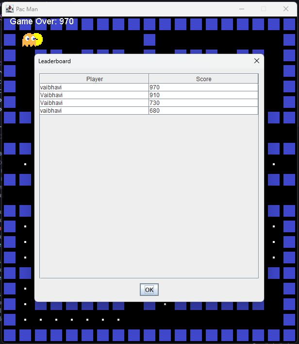

# 🎮 Pac-Man Game (Java + PostgreSQL)

A modern recreation of the classic Pac-Man arcade game using Java Swing for GUI and PostgreSQL for managing players and leaderboard scores.

---

## 🧠 Overview

This game allows a player to navigate through a maze, eat food pellets, avoid ghosts, and track scores. A PostgreSQL backend stores player names, high scores, and displays a dynamic leaderboard at the end of the game.

---

## 🔥 Features

- 👾 Classic Pac-Man mechanics with animated character control  
- 🧠 Randomized ghost AI and movement logic  
- 🍒 Food collection and score tracking  
- 💥 Lives system and Game Over screen  
- 🏆 PostgreSQL-powered leaderboard and high score persistence  
- 🎨 GUI built with Java Swing and rendered via `JPanel`  

---

## 🛠️ Tech Stack

| Area        | Technology         |
|-------------|--------------------|
| Language    | Java               |
| GUI         | Java Swing         |
| Database    | PostgreSQL         |
| Connectivity| JDBC               |
| IDE         | IntelliJ / Eclipse |

---

## 📁 Project Structure

```bash
.
├── App.java                # Launches the game
├── PacMan.java             # Core game logic and UI rendering
├── DatabaseManager.java    # Handles all database operations
├── wall.png                # Wall tile image
├── pacmanUp.png            # Pac-Man up-facing sprite
├── pacmanDown.png          # Pac-Man down-facing sprite
├── pacmanLeft.png          # Pac-Man left-facing sprite
├── pacmanRight.png         # Pac-Man right-facing sprite
├── blueGhost.png           # Blue ghost sprite
├── redGhost.png            # Red ghost sprite
├── pinkGhost.png           # Pink ghost sprite
├── orangeGhost.png         # Orange ghost sprite
```

---

## ⚙️ Setup Instructions

### ✅ Prerequisites

- Java JDK 8 or above  
- PostgreSQL installed and running locally  
- JDBC Driver for PostgreSQL (`postgresql-<version>.jar` in your classpath)  
- An IDE (like IntelliJ or Eclipse) or terminal for compilation  

### 🧑‍🍳 Steps to Run

#### 1. Clone the Repository:

```bash
git clone https://github.com/your-username/pacman-java-db.git
cd pacman-java-db
```

#### 2. Set up the PostgreSQL Database:

```sql
CREATE DATABASE databasemanager;

\c databasemanager

CREATE TABLE players (
  id SERIAL PRIMARY KEY,
  name VARCHAR(50) UNIQUE NOT NULL,
  high_score INTEGER DEFAULT 0
);

CREATE TABLE leaderboard (
  id SERIAL PRIMARY KEY,
  player_id INTEGER REFERENCES players(id),
  score INTEGER NOT NULL
);
```

#### 3. Update DatabaseManager.java Credentials:

```java
private static final String URL = "jdbc:postgresql://localhost:5432/databasemanager";
private static final String USER = "your_db_username";
private static final String PASSWORD = "your_db_password";
```

#### 4. Compile the Code:

```bash
javac -cp ".:postgresql-<version>.jar" App.java PacMan.java DatabaseManager.java
```

#### 5. Run the Game:

```bash
java -cp ".:postgresql-<version>.jar" App
```

---

## 🧾 Database Schema

### `players` Table

| Column Name | Type    | Description                   |
|-------------|---------|-------------------------------|
| id          | SERIAL  | Primary key                   |
| name        | VARCHAR | Player name (unique)          |
| high_score  | INTEGER | Highest score by the player   |

### `leaderboard` Table

| Column Name | Type    | Description                         |
|-------------|---------|-------------------------------------|
| id          | SERIAL  | Primary key                         |
| player_id   | INTEGER | References `players(id)`            |
| score       | INTEGER | Score achieved in a session         |

---

## 🎮 How to Play

- Use **Arrow Keys** (`↑ ↓ ← →`) to move Pac-Man  
- Eat food pellets (`.`) to increase your score  
- Avoid ghosts! You lose one life per collision  
- You have 3 lives; game ends after losing all  
- When all food is eaten, the map resets  
- After game over:  
  - View the top 5 scores in the leaderboard  
  - Choose to restart or exit the game  

---

## 📸 Screenshots

> _Add these image files in a `screenshots/` folder and update filenames as needed._

```markdown



```

---

## 🌟 Future Enhancements

- 🔊 Add background music and sound effects  
- 💣 Introduce power pellets and ghost-chasing mode  
- 🗺️ Add difficulty levels and multiple maps  
- 🤖 Implement smarter ghost AI using pathfinding (A*, BFS)  
- 📱 Port to Android using JavaFX or Android SDK  

---

## 👩‍💻 Author

**Vaibhavi H R**  
BSc Data Science, RV University  
📧 [vaibhavihr1@gmail.com]  
🔗 [LinkedIn](https://www.linkedin.com/in/vaibhavi-h-r/)  
🔗 [GitHub](https://github.com/vaibhavihr)

---

## 📄 License

This project is created for educational and academic use.  
Feel free to fork, modify, and use it for learning or portfolios. Attribution appreciated.
